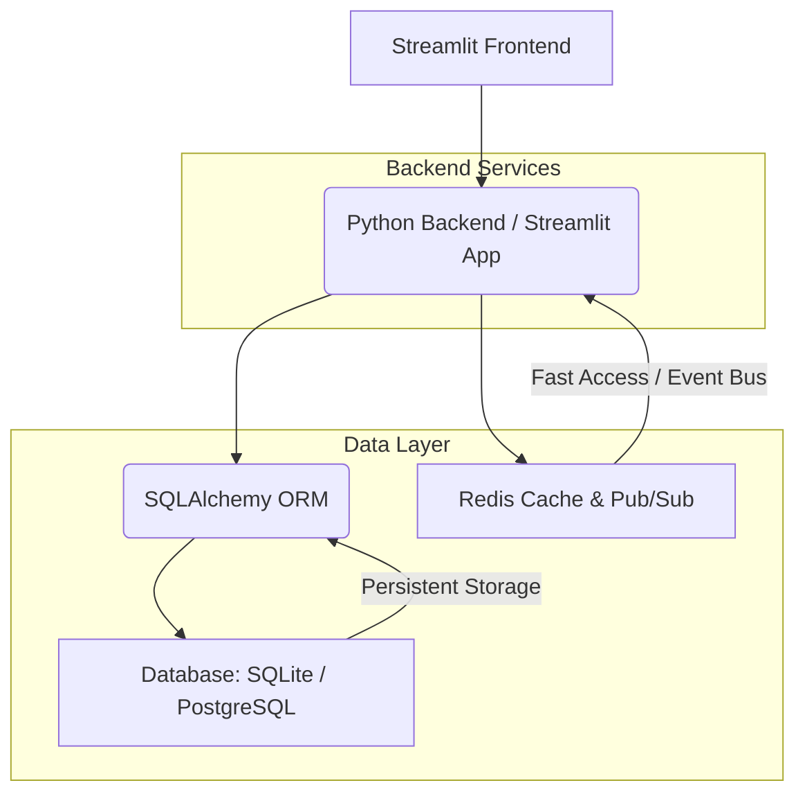
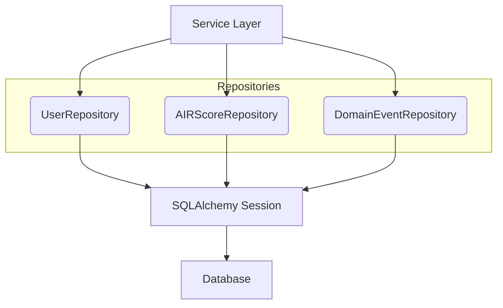
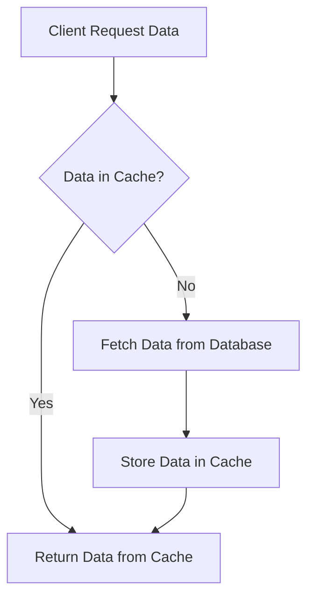

id: 695eb9a552f3eacc6a5aee44_documentation
summary: Data Architecture & Persistence Documentation
feedback link: https://docs.google.com/forms/d/e/1FAIpQLSfWkOK-in_bMMoHSZfcIvAeO58PAH9wrDqcxnJABHaxiDqhSA/viewform?usp=sf_link
environments: Web
status: Published
# QuLab: Building a Scalable AI Backend with Modern Data Architecture

## Introduction: Scaling the AI Backend's Data Layer
Duration: 05:00

<aside class="positive">
This codelab guides you through designing and implementing a robust, performant, and reliable data architecture for an AI-powered assessment platform. Understanding these patterns is crucial for any developer building scalable backend services.
</aside>

**Persona:** Alex, Senior Software Engineer at InnovateAI Solutions.
**Organization:** InnovateAI Solutions is a cutting-edge company building an AI-powered assessment platform. This platform helps users evaluate their skills and receive AI-driven recommendations.

**The Challenge:** In Lab 1, Alex successfully laid the foundation for a scalable Python backend. Now, the focus shifts to the critical data layer. As InnovateAI's platform gains traction, Alex faces the challenge of designing and implementing a robust, performant, and reliable data architecture. This involves not only persisting complex AI-related data but also ensuring efficient access patterns, handling concurrent requests, and reliably communicating events across a growing microservices ecosystem. Alex needs to ensure the data layer can support high throughput, low latency, and maintain data integrity, all while being adaptable to future changes.

This application simulates Alex's workflow in tackling these challenges, demonstrating practical application of modern data persistence patterns using SQLAlchemy 2.0 and Redis.

### Key Objectives
*   **Remember**: List SQLAlchemy relationship types and Redis data structures.
*   **Understand**: Explain async database patterns and connection pooling.
*   **Apply**: Implement repository pattern with SQLAlchemy 2.0.
*   **Analyze**: Compare caching strategies for different access patterns.
*   **Create**: Design event tables for pub/sub architecture.

### Tools and Concepts Introduced
*   **SQLAlchemy 2.0**: A powerful Object-Relational Mapper (ORM) for Python, offering asynchronous support, type hints, and modern declarative mapping. It bridges the gap between Python objects and relational database tables.
*   **Redis**: An in-memory data store used for caching, real-time analytics, and as a message broker for publish/subscribe (Pub/Sub) patterns.
*   **Async database sessions with context managers**: Leveraging `asyncio` for non-blocking I/O with databases, improving application responsiveness.
*   **Repository pattern for data access abstraction**: A design pattern that centralizes data access logic, making the codebase cleaner, more testable, and loosely coupled from specific ORM or database implementations.
*   **Connection pooling for scalability**: A technique to manage and reuse database connections, reducing the overhead of establishing new connections for every request and improving throughput.
*   **Event sourcing tables for pub/sub (Outbox pattern)**: A robust pattern for reliably publishing domain events within a distributed system, ensuring atomicity between a business operation and event recording.

### Application Architecture Overview

Below is a high-level architecture diagram illustrating how different components of the application interact with the data layer.



In this architecture:
*   The **Streamlit Frontend** is the user interface.
*   The **Python Backend / Streamlit App** contains the business logic and interacts with the data layer.
*   **SQLAlchemy ORM** provides the object-relational mapping to the database.
*   **Database (SQLite / PostgreSQL)** serves as the primary persistent data store.
*   **Redis** acts as both a high-speed cache and a message broker for event-driven communication.

This setup allows for efficient data persistence, retrieval, and inter-service communication, addressing the scalability challenges Alex faces.

## 1. Defining the Core Data Schema with SQLAlchemy 2.0
Duration: 08:00

Alex starts by meticulously defining the data models that will underpin InnovateAI's AI assessment platform. This involves capturing user profiles, their ongoing assessments, the crucial AI-R scores, and a mechanism for tracking system events. He leverages SQLAlchemy 2.0's modern declarative mapping and type hints for clarity and robustness.

Correctly structured data models are fundamental for reliable data storage, efficient querying, and understanding the relationships between different entities in a complex AI system. SQLAlchemy's ORM helps bridge the gap between Python objects and relational database tables, ensuring type safety and reducing boilerplate code.

Relational Algebra is the foundation for database operations. A relationship between two tables, say `Users` and `Assessments`, implies a join operation. For example, to find all assessments for a user, one might perform a projection and join operation as shown below.
$$ \pi_{\text{Assessment.*}}(\text{Users} \bowtie_{\text{Users.id} = \text{Assessments.user\_id}} \text{Assessments}) $$
Here, $ \pi $ denotes projection (selecting specific columns) and $ \bowtie $ denotes natural join (combining rows from two tables based on a common column). SQLAlchemy relationships abstract this, making it object-oriented and intuitive in Python code.

### SQLAlchemy Models Overview

Here's a glimpse into the SQLAlchemy model definitions Alex has created:

**TimestampMixin**: A reusable mixin for `created_at` and `updated_at` fields.
```python
class TimestampMixin:
    created_at: Mapped[datetime] = mapped_column(DateTime(timezone=True), default=datetime.utcnow)
    updated_at: Mapped[datetime] = mapped_column(DateTime(timezone=True), default=datetime.utcnow, onupdate=datetime.utcnow)
```

**User Model**: Represents user profiles. It includes relationships to `Assessment` and `AIRScore` models. The `cascade="all, delete-orphan"` ensures that when a user is deleted, their related assessments and scores are also deleted.
```python
class User(Base, TimestampMixin):
    __tablename__ = "users"
    id: Mapped[str] = mapped_column(String(36), primary_key=True, default=lambda: str(uuid.uuid4()))
    email: Mapped[str] = mapped_column(String(255), unique=True, index=True)
    name: Mapped[str] = mapped_column(String(255))
    occupation_code: Mapped[Optional[str]] = mapped_column(String(20))
    education_level: Mapped[Optional[str]] = mapped_column(String(50))
    years_experience: Mapped[Optional[float]] = mapped_column(Float)
    assessments: Mapped[List["Assessment"]] = relationship(back_populates="user", cascade="all, delete-orphan", lazy="selectin")
    scores: Mapped[List["AIRScore"]] = relationship(back_populates="user", cascade="all, delete-orphan", lazy="selectin")

    def to_dict(self):
        return {
            "id": self.id,
            "email": self.email,
            "name": self.name,
            "occupation_code": self.occupation_code,
            "education_level": self.education_level,
            "years_experience": self.years_experience,
            "created_at": self.created_at.isoformat() if self.created_at else None,
            "updated_at": self.updated_at.isoformat() if self.updated_at else None,
        }
```

**Assessment Model**: Tracks user's evaluation sessions. Each assessment is linked to a user via `user_id`.
```python
class Assessment(Base, TimestampMixin):
    __tablename__ = "assessments"
    id: Mapped[str] = mapped_column(String(36), primary_key=True, default=lambda: str(uuid.uuid4()))
    user_id: Mapped[str] = mapped_column(ForeignKey("users.id"), index=True)
    status: Mapped[str] = mapped_column(String(20), default="in_progress")
    component: Mapped[str] = mapped_column(String(50))
    current_ability: Mapped[float] = mapped_column(Float, default=0.0)
    items_administered: Mapped[int] = mapped_column(default=0)
    user: Mapped["User"] = relationship(back_populates="assessments")
```

**AIRScore Model**: Stores AI-generated assessment results. This model includes various score components and `calculation_metadata` stored as JSON.
```python
class AIRScore(Base, TimestampMixin):
    __tablename__ = "air_scores"
    id: Mapped[str] = mapped_column(String(36), primary_key=True, default=lambda: str(uuid.uuid4()))
    user_id: Mapped[str] = mapped_column(ForeignKey("users.id"), index=True)
    occupation_code: Mapped[str] = mapped_column(String(20))
    air_score: Mapped[float] = mapped_column(Float)
    vr_score: Mapped[float] = mapped_column(Float)
    hr_score: Mapped[float] = mapped_column(Float)
    synergy_score: Mapped[float] = mapped_column(Float)
    ci_lower: Mapped[float] = mapped_column(Float)
    ci_upper: Mapped[float] = mapped_column(Float)
    parameter_version: Mapped[str] = mapped_column(String(20))
    calculation_metadata: Mapped[dict] = mapped_column(JSON, default=dict)
    user: Mapped["User"] = relationship(back_populates="scores")

    def to_dict(self):
        return {
            "id": self.id,
            "user_id": self.user_id,
            "occupation_code": self.occupation_code,
            "air_score": self.air_score,
            "vr_score": self.vr_score,
            "hr_score": self.hr_score,
            "synergy_score": self.synergy_score,
            "ci_lower": self.ci_lower,
            "ci_upper": self.ci_upper,
            "parameter_version": self.parameter_version,
            "calculation_metadata": self.calculation_metadata,
            "created_at": self.created_at.isoformat() if self.created_at else None,
            "updated_at": self.updated_at.isoformat() if self.updated_at else None,
        }
```

**DomainEvent Model**: For reliable event communication (Outbox Pattern). This is crucial for distributed systems. The `payload` field uses SQLAlchemy's `JSON` type for flexible storage of event data.
```python
class DomainEvent(Base, TimestampMixin):
    __tablename__ = "domain_events"
    id: Mapped[str] = mapped_column(String(36), primary_key=True, default=lambda: str(uuid.uuid4()))
    event_type: Mapped[str] = mapped_column(String(100), nullable=False, index=True)
    aggregate_type: Mapped[str] = mapped_column(String(100), nullable=False)
    aggregate_id: Mapped[str] = mapped_column(String(36), nullable=False, index=True)
    payload: Mapped[Dict[str, Any]] = mapped_column(JSON, nullable=False)
    status: Mapped[str] = mapped_column(String(20), default="pending")
    published_at: Mapped[Optional[datetime]] = mapped_column(DateTime(timezone=True))
    __table_args__ = (Index('ix_events_status_created', 'status', 'created_at'),)
```

Alex has now laid out the blueprints for the application's data. The `User` model captures core profile information, `Assessment` tracks user progress, `AIRScore` stores AI-generated evaluation results, and `DomainEvent` is for reliable event communication. The relationships are defined using `relationship` and `ForeignKey`, ensuring data integrity. `cascade="all, delete-orphan"` on `User` relationships simplifies data lifecycle management.

### Interactive Model Demonstration: Create a New User

Navigate to the "1. Data Models" section in the Streamlit application.
Use the form to create a new user and observe it being persisted.

1.  Enter a unique **New User Email** (e.g., `new.user@example.com`).
2.  Enter a **New User Name** (e.g., `New Test User`).
3.  Click the **Create User** button.

You should see a success message with the newly created user's ID. This demonstrates the basic `create` operation through the `UserRepository`.

## 2. Establishing Asynchronous Database Connectivity and Connection Pooling
Duration: 07:00

InnovateAI's AI platform needs to handle many concurrent user requests without blocking. Alex knows that synchronous database operations can become a bottleneck, especially with a growing user base. He sets up an asynchronous database connection using SQLAlchemy 2.0 with the `aiosqlite` driver (for this codelab's SQLite setup; `asyncpg` would be used for PostgreSQL) and configures connection pooling to efficiently manage database resources. This configuration is essential for maximizing throughput and responsiveness.

Asynchronous programming is crucial for high-performance I/O-bound applications like web services. Connection pooling prevents the overhead of repeatedly establishing new database connections, improving throughput and responsiveness under load. Without it, each new request might incur the cost of a full database handshake, drastically slowing down the application.

### Key Concepts

*   **Throughput ($ \Theta $)**: The rate at which requests are processed. Asynchronous I/O aims to maximize $ \Theta $ by minimizing idle CPU time during I/O wait.
    $$ \Theta = \frac{\text{Number of requests}}{\text{Total time}} $$
*   **Connection Pool Efficiency**: The effective connection pool size can be estimated as the number of available connections $ N_{\text{avail}} $ out of the maximum pool size $ N_{\text{max}} $. A well-tuned pool minimizes latency due to connection acquisition and releases resources promptly.
*   **ACID Properties**: Transactional guarantees are crucial for data integrity:
    *   **Atomicity**: Operations within a transaction are all or nothing.
    *   **Consistency**: A transaction brings the database from one valid state to another.
    *   **Isolation**: Concurrent transactions produce the same result as if they were executed sequentially.
    *   **Durability**: Once a transaction is committed, it remains committed even in case of power loss.

### Database Engine and Session Setup

The `async_engine` and `AsyncSessionLocal` are central to Alex's asynchronous strategy. The `get_session` context manager ensures that database connections are properly acquired and released. The `pool_size` and `max_overflow` parameters are crucial for connection pooling, allowing the application to reuse existing connections and handle spikes in demand gracefully.

```python
#  Configuration 
DATABASE_URL = "sqlite+aiosqlite:///./test.db" # Using aiosqlite for async SQLite

#  Database Engine and Session Setup 
async_engine = create_async_engine(DATABASE_URL, echo=False, future=True, pool_size=10, max_overflow=20)
AsyncSessionLocal = sessionmaker(
    async_engine, expire_on_commit=False, class_=AsyncSession
)

async def get_session() -> AsyncGenerator[AsyncSession, None]:
    async with AsyncSessionLocal() as session:
        yield session

async def init_db():
    async with async_engine.begin() as conn:
        await conn.run_sync(Base.metadata.create_all)
```
*   `create_async_engine`: Initializes the asynchronous database engine. `pool_size` (10) sets the number of connections to keep open in the pool, and `max_overflow` (20) allows the pool to temporarily create more connections beyond `pool_size` to handle peak loads, up to `pool_size + max_overflow` connections.
*   `AsyncSessionLocal`: A session factory that creates `AsyncSession` objects, which are the primary interface for interacting with the database using SQLAlchemy's ORM in an async context.
*   `get_session`: An asynchronous context manager that provides a database session. It ensures that the session is properly closed after use, releasing the connection back to the pool.
*   `init_db`: A function that creates all defined tables in the database.

### Interactive Demonstration: Initialize Database

Navigate to the "2. DB Connectivity & Pooling" section in the Streamlit application.

1.  Click the **Initialize In-Memory SQLite Database & Create Sample Users** button.

You will see success messages confirming that the database schema has been created and two sample users ("Alex Smith" and "Jane Doe") have been added. Their IDs will also be displayed. This action cleans up any prior data and ensures a fresh state for the codelab.

<aside class="positive">
A common pitfall is to forget to `await` asynchronous database calls. SQLAlchemy's async ORM heavily relies on `await` for all database interactions (e.g., `session.execute`, `session.commit`).
</aside>

## 3. Implementing the Repository Pattern and Solving N+1 Queries
Duration: 10:00

To maintain a clean architecture and facilitate easier testing, Alex implements the Repository Pattern, abstracting database operations from the service layer. He also anticipates a common performance pitfall: the N+1 query problem, which arises when fetching a collection of parent objects and then, for each parent, executing a separate query to fetch its child objects. This can drastically degrade performance, especially when dealing with many related records. Alex addresses this with SQLAlchemy's eager loading techniques.

The Repository Pattern centralizes data access logic, making it easier to manage, test, and potentially swap out ORM or database technologies in the future. The N+1 query problem occurs when loading $ N $ parent objects (e.g., users) and then subsequently executing $ N $ additional queries to fetch their related child objects (e.g., scores), resulting in $ N+1 $ queries in total. This is highly inefficient. Eager loading techniques like `selectinload` reduce this to $ 1 $ or $ 2 $ queries, improving performance significantly.

### Repository Pattern Diagram


This diagram illustrates how the Service Layer interacts with specific Repositories (e.g., `UserRepository`) which, in turn, use the SQLAlchemy Session to communicate with the database. This abstraction decouples business logic from data access details.

### Repository Implementations

Alex creates a `BaseRepository` for common operations and specialized repositories for each model:

```python
class BaseRepository:
    def __init__(self, session: AsyncSession):
        self.session = session

    async def create(self, model_instance: Base):
        self.session.add(model_instance)
        await self.session.flush()
        return model_instance

    async def get_by_id(self, model_id: str, model_class: type[Base]):
        result = await self.session.execute(
            select(model_class).filter_by(id=model_id)
        )
        return result.scalars().first()

class UserRepository(BaseRepository):
    # ... (other methods) ...
    async def get_user_with_scores_eager(self, user_id: str) -> Optional[User]:
        # Corrected to use selectinload for eager loading of collections
        result = await self.session.execute(
            select(User).filter_by(id=user_id).options(selectinload(User.scores))
        )
        return result.scalars().unique().first()

    async def get_latest_score(self, user_id: str) -> Optional[AIRScore]:
        result = await self.session.execute(
            select(AIRScore).filter_by(user_id=user_id).order_by(AIRScore.created_at.desc()).limit(1)
        )
        return result.scalars().first()
```
The `get_user_with_scores_eager` method is key here. By using `options(selectinload(User.scores))`, SQLAlchemy knows to fetch the related `AIRScore` objects for the user in an optimized way (typically one additional query), avoiding the N+1 problem.

### Interactive Demonstration: N+1 vs. Eager Loading

Navigate to the "3. Repository Pattern & N+1" section in the Streamlit application.

1.  First, ensure you have sample scores for a user. If not, enter Alex's User ID (obtained from the previous step, e.g., `st.session_state.user_alex_id`) into the "User ID to add scores for" input and click **Add 3 Sample Scores for User**.
2.  Now, in the "Demonstrating N+1 vs. Eager Loading" section, enter the same User ID in the "User ID to fetch" input.
3.  Click **Fetch User & Scores (Simulated N+1)**. Observe the time taken. Internally, SQLAlchemy's lazy loading will cause separate queries for each score, simulating the N+1 problem.
4.  Click **Fetch User & Scores (Eager Loading)**. Observe the time taken. This uses `selectinload` to fetch the user and all their scores in a more efficient manner.

You should notice that the "Eager Loading" approach is significantly faster because it performs fewer database queries. This highlights the importance of using eager loading for relationships that are frequently accessed together.

By implementing `UserRepository`, Alex has created a clean boundary between the business logic and data access. The `get_user_with_scores_eager` method, utilizing `selectinload(User.scores)`, directly addresses the N+1 query problem by fetching related `AIRScore` objects in a minimal number of queries. This significantly reduces database load and improves response times, as observed by the difference in execution times.

## 4. Optimizing Data Access with Redis Caching Strategies
Duration: 12:00

InnovateAI's user profiles and their latest AI scores are frequently accessed, especially during the initial loading of the user dashboard. To offload the primary PostgreSQL database and accelerate response times for these hot data points, Alex decides to implement a caching layer using Redis. He considers a read-through caching strategy, where data is fetched from the cache if available, otherwise from the database and then stored in the cache for subsequent requests.

Caching is critical for high-performance applications, reducing latency and database load by storing frequently accessed data in a fast, in-memory store like Redis. The read-through strategy is robust for frequently read, less frequently updated data. It simplifies cache management by encapsulating the cache-or-DB logic.

### Caching Metrics

*   **Cache Hit Ratio ($ H $)**: Measures the effectiveness of caching. A higher $ H $ indicates better cache performance.
    $$ H = \frac{\text{Number of Cache Hits}}{\text{Total Number of Requests}} $$
*   **Average Access Time ($ T_{\text{avg}} $)**: Represents the average time taken to retrieve data. A good caching strategy aims to minimize $ T_{\text{avg}} $.
    $$ T_{\text{avg}} = H \times T_{\text{cache}} + (1-H) \times (T_{\text{cache}} + T_{\text{database}}) $$
    where $ T_{\text{cache}} $ is cache access time and $ T_{\text{database}} $ is database access time.

### Caching Flow Diagram


This diagram illustrates the read-through caching strategy. The client first checks the cache. If found (hit), data is returned quickly. If not found (miss), the data is retrieved from the database, stored in the cache, and then returned to the client.

### Cached Repository Implementation

Alex extends the `UserRepository` to include caching logic using Redis.

```python
import json
import redis.asyncio as aioredis # Or unittest.mock for mock client

class CachedUserRepository(UserRepository):
    def __init__(self, session: AsyncSession, redis_client):
        super().__init__(session)
        self.redis_client = redis_client
        self.USER_CACHE_PREFIX = "user:"
        self.LATEST_SCORE_CACHE_PREFIX = "latest_airscore:"
        self.CACHE_TTL = 3600  # 1 hour

    async def _get_from_cache(self, key: str) -> Optional[Dict]:
        data = await self.redis_client.get(key)
        return json.loads(data) if data else None

    async def _set_to_cache(self, key: str, data: Dict):
        await self.redis_client.set(key, json.dumps(data), ex=self.CACHE_TTL)

    async def get_by_id_cached(self, user_id: str) -> Optional[User]:
        cache_key = f"{self.USER_CACHE_PREFIX}{user_id}"
        cached_data = await self._get_from_cache(cache_key)
        if cached_data:
            # Reconstruct User from dict
            # ... (datetime conversion logic) ...
            return User(**cached_data) 
        
        user = await super().get_by_id(user_id)
        if user:
            await self._set_to_cache(cache_key, user.to_dict())
        return user

    async def get_latest_score_cached(self, user_id: str) -> Optional[AIRScore]:
        cache_key = f"{self.LATEST_SCORE_CACHE_PREFIX}{user_id}"
        cached_data = await self._get_from_cache(cache_key)
        if cached_data:
            # Reconstruct AIRScore from dict
            # ... (datetime conversion logic) ...
            return AIRScore(**cached_data)

        score = await super().get_latest_score(user_id)
        if score:
            await self._set_to_cache(cache_key, score.to_dict())
        return score

    async def invalidate_user_cache(self, user_id: str):
        await self.redis_client.delete(f"{self.USER_CACHE_PREFIX}{user_id}")
        await self.redis_client.delete(f"{self.LATEST_SCORE_CACHE_PREFIX}{user_id}")
```
*   `_get_from_cache` and `_set_to_cache`: Handle serialization/deserialization of data to/from Redis.
*   `get_by_id_cached` and `get_latest_score_cached`: Implement the read-through logic: check cache first, then DB, then populate cache.
*   `invalidate_user_cache`: Crucial for cache consistency. When underlying data changes, stale cache entries must be removed.

### Interactive Demonstration: Caching

Navigate to the "4. Caching with Redis" section in the Streamlit application.

1.  The application will automatically prepare a "Cache Demo User" and their latest score.
2.  Click **Fetch User (Cached)** for the first time. This will be a cache miss (slower).
3.  Click **Fetch User (Cached)** again. This will be a cache hit (faster).
4.  Repeat for **Fetch Latest AIRScore (Cached)**.
5.  Observe the "Cache Metrics" at the bottom to see how hit/miss counts change.
6.  Click **Invalidate Cache for this User**. This clears the user's data from Redis.
7.  Now, try fetching the user or score again. The first attempt will be a cache miss.

<aside class="negative">
If your local Redis server is not running, the application will automatically fall back to a mock Redis client. While this allows the app to function, you won't observe actual performance differences from a real Redis cache. To experience the full benefit, ensure Redis is installed and running (`redis-server`).
</aside>

Alex's implementation of `CachedUserRepository` successfully demonstrates a read-through caching strategy. The first request will typically result in a 'Cache MISS' (fetching from DB), and subsequent requests for the same data show a 'Cache HIT' (retrieving directly from Redis). The `invalidate_user_cache` method ensures data consistency by clearing stale cache entries after updates. This optimizes data access for read-heavy operations, improving the user experience.

## 5. Building a Reliable Eventing System with the Outbox Pattern
Duration: 15:00

Alex is tasked with ensuring that critical domain events (like an `AIRScore` being calculated or an `Assessment` completing) are reliably published to other microservices within InnovateAI, even in the face of temporary network issues or consumer downtime. He implements the Outbox Pattern, using the `DomainEvent` table as a robust buffer. This pattern is vital for ensuring that services remain loosely coupled and that event-driven architectures maintain data consistency.

In distributed systems, reliable communication between services is paramount. The Outbox Pattern ensures atomicity: a business operation and the recording of its corresponding domain event happen within a single database transaction. This guarantees that events are never lost if the publishing mechanism fails after the business operation succeeds but before the event is sent to the message broker. It leverages the ACID properties of the database.

The Outbox Pattern helps achieve **eventual consistency**. In a distributed system, data might not be immediately consistent across all services, but it will eventually converge. By guaranteeing events are eventually delivered, the Outbox pattern facilitates this convergence without requiring a complex two-phase commit protocol across services.

### Outbox Pattern Flowchart

```mermaid
graph TD
    A[Service performs Business Logic] --> B{Start DB Transaction}
    B --> C[Update Business Data in DB]
    C --> D[Insert DomainEvent into Outbox Table (status=pending)]
    D --> E{Commit DB Transaction}
    E -- Success --> F[Event Publisher polls Outbox]
    F --> G{Retrieve Pending Events}
    G -- Events Found --> H[Publish Events to Message Broker]
    H --> I[Mark Events as Published in DB]
    I --> J{Commit DB Transaction (for status update)}
    G -- No Events --> F
    E -- Failure --> K[Rollback DB Transaction]
    K --> A
```
This flowchart illustrates the Outbox Pattern. The key is that steps C and D happen within a single database transaction. If the transaction commits, both business data and the event record are persisted. An independent "Event Publisher" then reads pending events from the Outbox table and publishes them, marking them as `published` in another transaction.

### Domain Event Repository and Event Creation

The `DomainEventRepository` manages events, allowing retrieval of pending events and marking them as published. The `calculate_and_store_airscore` function demonstrates how a business operation and event creation are bundled into one transaction.

```python
class DomainEventRepository(BaseRepository):
    # ... (init and get_by_id) ...

    async def get_pending_events(self, limit: int = 10) -> List[DomainEvent]:
        result = await self.session.execute(
            select(DomainEvent).filter_by(status="pending").order_by(DomainEvent.created_at).limit(limit)
        )
        return result.scalars().all()

    async def mark_as_published(self, event_ids: List[str]):
        for event_id in event_ids:
            event = await self.session.execute(select(DomainEvent).filter_by(id=event_id)).scalars().first()
            if event:
                event.status = "published"
                event.published_at = datetime.utcnow()
                self.session.add(event)
        await self.session.commit() # Commit all status updates in one go

async def calculate_and_store_airscore(user_id: str, occupation_code: str) -> tuple[AIRScore, DomainEvent]:
    async for session in get_session():
        # Create AIRScore
        score = AIRScore( # ... score details ... )
        session.add(score)
        
        # Create DomainEvent within the same session/transaction
        await session.flush()  # Ensure score has an ID before event payload
        event_payload = {
            "user_id": user_id,
            "air_score_id": score.id,
            "occupation_code": score.occupation_code,
            "air_score_value": score.air_score
        }
        event = DomainEvent(
            event_type="AIRScoreCalculated",
            aggregate_type="AIRScore",
            aggregate_id=score.id,
            payload=event_payload,
            status="pending"
        )
        session.add(event)
        
        await session.commit() # Atomic commit for both score and event
        await session.refresh(score)
        await session.refresh(event)
        return score, event
```
*   `calculate_and_store_airscore`: This function is critical. It creates both the `AIRScore` and a `DomainEvent` within a single `AsyncSession` and `await session.commit()`. This guarantees atomicity. If the score is saved, the event is also saved, or neither is.
*   `get_pending_events`: Used by the simulated event publisher to find events that need to be sent.
*   `mark_as_published`: Updates the status of events after they have been "published" (simulated here), preventing them from being processed again.

### Interactive Demonstration: Outbox Pattern

Navigate to the "5. Eventing (Outbox Pattern)" section in the Streamlit application.

1.  The application will prepare an "Event Demo User".
2.  Click **Calculate & Store AIRScore (Creates Pending Event)**. This will create a new AIRScore and a `DomainEvent` marked as `pending` in the database.
3.  Observe the "Pending Events" table below. You should see the newly created event.
4.  Click **Start Event Publisher (Background)**. This simulates a background service that polls for pending events, marks them as published, and moves them to the "Published Events" table.
5.  Wait for the publisher to run for a few cycles (it's set to 3 cycles in the demo for brevity). You'll see messages indicating publisher activity.
6.  Click **Refresh Event Status Now** to manually update the event tables. Observe the event moving from "Pending Events" to "Published Events".
7.  You can click **Calculate & Store AIRScore (Creates Pending Event)** multiple times and restart the publisher to see more events being processed.
8.  If the publisher is running, you can click **Stop Event Publisher** to signal it to stop processing after its current cycle.

Alex's implementation clearly demonstrates the Outbox Pattern. When `calculate_and_store_airscore` is called, both the `AIRScore` record and the `DomainEvent` are created within a single database transaction, guaranteeing atomicity. The `DomainEvent` is initially marked `pending`.

The simulated `event_publisher` then periodically polls the `domain_events` table for `pending` events. Upon finding them, it simulates publishing them and then updates their status to `published` in the database. This two-phase commit strategy ensures no event is ever lost, even if an external message broker is temporarily unavailable. Alex can verify this process by observing the status transitions.
